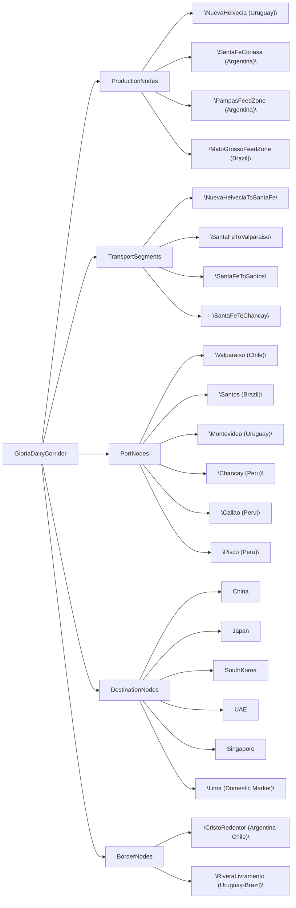

## Flowchart

```mermaid
graph LR;
    GloriaDairyCorridor --> ProductionNodes;
    GloriaDairyCorridor --> TransportSegments;
    GloriaDairyCorridor --> PortNodes;
    GloriaDairyCorridor --> DestinationNodes;
    GloriaDairyCorridor --> BorderNodes;

    ProductionNodes --> NuevaHelvecia["\NuevaHelvecia (Uruguay)\"]
    ProductionNodes --> SantaFeCorlasa["\SantaFeCorlasa (Argentina)\"]
    ProductionNodes --> PampasFeedZone["\PampasFeedZone (Argentina)\"]
    ProductionNodes --> MatoGrossoFeedZone["\MatoGrossoFeedZone (Brazil)\"]

    TransportSegments --> NuevaHelveciaToSantaFe["\NuevaHelveciaToSantaFe\"]
    TransportSegments --> SantaFeToValparaiso["\SantaFeToValparaiso\"]
    TransportSegments --> SantaFeToSantos["\SantaFeToSantos\"]
    TransportSegments --> SantaFeToChancay["\SantaFeToChancay\"]

    PortNodes --> Valparaiso["\Valparaiso (Chile)\"]
    PortNodes --> Santos["\Santos (Brazil)\"]
    PortNodes --> Montevideo["\Montevideo (Uruguay)\"]
    PortNodes --> Chancay["\Chancay (Peru)\"]
    PortNodes --> Callao["\Callao (Peru)\"]
    PortNodes --> Pisco["\Pisco (Peru)\"]

    DestinationNodes --> China
    DestinationNodes --> Japan
    DestinationNodes --> SouthKorea
    DestinationNodes --> UAE
    DestinationNodes --> Singapore
    DestinationNodes --> Lima["\Lima (Domestic Market)\"]

    BorderNodes --> CristoRedentor["\CristoRedentor (Argentina-Chile)\"]
    BorderNodes --> RiveraLivramento["\RiveraLivramento (Uruguay-Brazil)\"]

```
